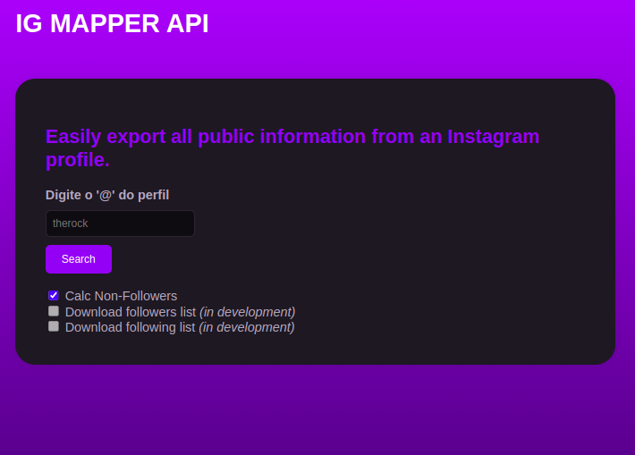
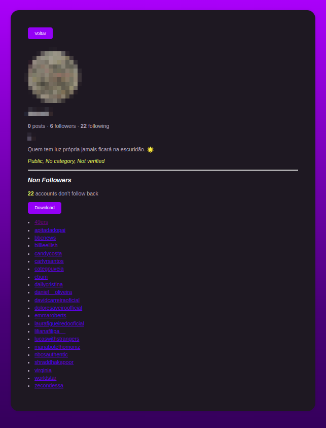

<div align="center">
   <picture>
      <source media="(prefers-color-scheme: dark)" srcset="assets/icon-unofficial.png"> 
	</picture>
      <source media="(prefers-color-scheme: dark)" srcset="assets/logo-instagram.png"> 
   <picture>
	</picture>
	<!-- <br><br><br> -->
	<hr>
<h1>igmapper: a <u>quick monitoring tool</u> for Instagram</h1>
   <br>
   <br>

</div>


## What is it?
Maps Non-Followers, Following and Followers...

## Main Features
Here are just a few of the things that pandas does well:

- list all followers who do not follow the account back;
- list all followers of an *Instagram* account;
- list all followers of an *Instagram* account.

<h2>Table of Contents</h2><br>

- [What is it?](#what-is-it)
- [Main Features](#main-features)
- [Where to get it / Install](#where-to-get-it--install)
- [Execute](#execute)
- [Documentation](#documentation)
- [License](#license)
- [Dependencies](#dependencies)
- [Execution Output](#execution-output)
  - [Screenshot](#screenshot)
  - [Terminal](#terminal)

## Where to get it / Install
The source code is currently hosted on GitHub.


> [!WARNING]
> It's essential to use [**Python 3.10** 🡽](https://www.python.org/downloads/release/python-310/) version

```sh
# upgrade pip
pip install --upgrade pip
```
```sh
# install requirements
pip install -r requirements.txt
```

## Execute
To run the application, on the terminal run:
```sh
cd <path_to>/instagram-followers
python scripts/main.py
```

## Documentation
- [Documentation 🡽](https://github.com/lucaslealll/igmapper-api/blob/main/doc/DOCUMENTATION.md)

## License
- [MIT 🡽](https://github.com/lucaslealll/igmapper-api/blob/main/LICENSE)

## Dependencies
- [requests 🡽](https://requests.readthedocs.io/en/latest/) | [selenium 🡽](https://www.selenium.dev/) | [tqdm 🡽](https://tqdm.github.io/)

See the [full installation instructions](https://github.com/lucaslealll/igmapper-api/blob/main/INSTALLATION.md) for minimum supported versions of required, recommended and optional dependencies.

## Execution Output
### Screenshot
<div align="center">
   
  
</div>

### Terminal
<pre>
<b>Instagram Followers & Unfollowers</b>
<b>Enter the Instagram username (without '@'):</b> athena.mentorship
Cookie file founded...
Retrieving user account ID...

<b>Investigated profile:</b>
    https://www.instagram.com/athena.mentorship
    <b>athena.mentorship</b> 🟓
    <b>0</b> posts     <b>9</b> followers     <b>3</b> following
    <b>Athena Mentorship</b>
    Education
    'Esclareça sua dúvida em um click!
    🧠 Para conectar mentes
    📚 Monitoria certificada online
    👇  Acompanhe nosso desenvolvimento'
    🔗 <b>['https://github.com/athena-mentorship']</b>

Get followers...
Get following...
Building following dictionary...
Building followers dictionary...
Get non followers...

<b>Don't follow back:</b>
  1) User Name A        username_a      https://instagram.com/username_a
  2) User Name B        username_b      https://instagram.com/username_b
  3) User Name C        username_c      https://instagram.com/username_c
<b>Do you want to show the following list? [Y/n]:</b> y
  1) User Name D        username_d      https://instagram.com/username_d
  2) User Name E        username_e      https://instagram.com/username_e
<b>Do you want to show the followers list? [Y/n]:</b> y
  1) User Name F        username_f      https://instagram.com/username_f
  2) User Name G        username_g      https://instagram.com/username_g
</pre>

<hr>

[⇧ Go to Top](#table-of-contents)
